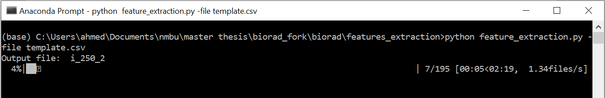
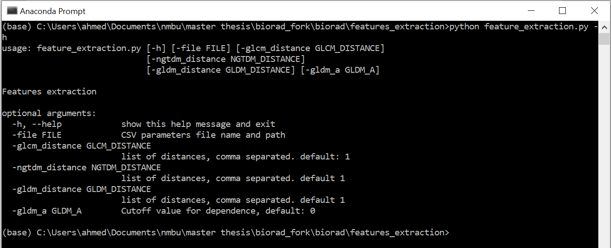
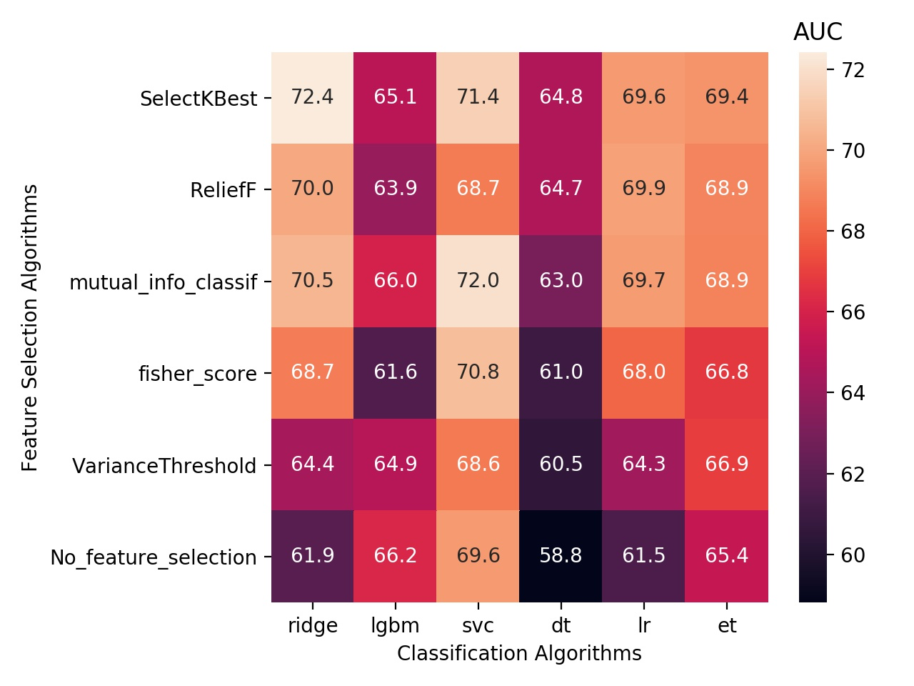

# imskaper

This project consists of two separate tools, one for radiomics feature
 extractions, and the second tool is for running experiments with different
  feature selection algorithms with various classifiers.

1. [ Getting Started ](#getting-started)

    1.1. [ Prerequisites ](#prerequisites)

    1.2. [ Installation ](#installing)
2. [ Features Extraction ](#features-extraction)
3. [ Features selection and classifications ](#features-selection-and-classifications)
4. [ License ](#license)
5. [ Acknowledgments ](#acknowledgments)

## Getting Started

Download or clone the code to your local machine and follow the instructions
 below to run the system in your local machine.

### Prerequisites

- Install Anaconda version 3.7 or above from:

    [https://www.anaconda.com/distribution/](https://www.anaconda.com/distribution/)

### Installing

- Open Anaconda prompt on windows or the command line in MacOS, navigate to the directory (inside the imskaper folder) where you placed the code on your local machine, and type the following command to install the project requirements:

**pip install -r requirements.txt**

If you are not familiar with the command line window, you can change the current working directory by using this command **cd c:\newpath**
Go through this quick tutorial for more information: [https://www.digitalcitizen.life/command-prompt-how-use-basic-commands](https://www.digitalcitizen.life/command-prompt-how-use-basic-commands)

After installing the project requirements, you should be able to run both the classifications and the features extraction tools.

## Features Extraction:

For features extraction, use the command prompt and navigate to the following folder:

imskaper\features\_extraction

modify the template.csv file

| image\_dir | mask\_dir | output\_file\_name | bin\_width | shape | first\_order | glszm | glrlm | ngtdm | gldm | glcm |
| --- | --- | --- | --- | --- | --- | --- | --- | --- | --- | --- |
| C:\tmp\250\ | C:\tmp\250\masks\ | i\_250\_2 | 25 |   | 1 | 1 | 1 |   | 1 | 1 |
| C:\tmp\500\ | C:\tmp\500\masks\ | i\_500\_2 | 25 | 1 | 1 | 1 | 1 |   | 1 | 1 |

- Modify image\_dir to the directories of your images, and the mask\_dir to the location of the masks, the masks names should match exactly the images names. If the mask is not provided, a dummy mask that covers the whole image will be automatically generated, but the shape features will not be applicable in that case.
- The output file where the results are stored, if you did not specify the full path, it will be stored at the current working directory.
- The bin\_width, the default value is 25, you can modify this value based on your need
- You have at the end of the csv file the list of radiomics features categories, write 1 if you want this category features to be extracted.

- Write the following command in the command prompt to run the tool:

**python feature\_extraction.py -file template.csv**

- Additional parameters can be provided for advanced settings:

## Features selection and classifications:

This tool tests random combinations of hyperparameters specified in a json file, and provide you with the following heatmap, which can help you in selecting the optimal features selector and classifier for your problem:

To run the tool, you will need to provide the dataset in a csv file, where the response variable is the last field, currently this tool can be used for binary classifications only, all data should be numerical, with no missing information.

Also, you will need a json file with the configurations, config.json under imskaper directory is a sample file, you can modify it to select the range of selected features, regularization parameters ranges, etc.

To modify a json file you can use any text editor, you can do that by right click on the file, open with, then select notepad

In the json file you will need to modify the path of the dataset file as follow:

&quot;features\_file&quot;: &quot;c:\\\tmp\\\hn\_ct\_c.csv&quot;, remember to
 use the escape character \"\\\" in the path, which means you should replace
  all single backslash characters with double backslashes, and do not forget the file extension &quot;.csv&quot;

Also, you will need to update the output directory, where the results are stored.

- In command prompt navigate to the imskaper directory
- Run the following command:
**python main.py -file config.json**

In addition to the heatmap, the tool will provide a csv files with the details of all the random experiments, the location of the csv file is provided in the configuration json file.

## License

This project is licensed under the MIT License - see the [LICENSE](LICENSE) file for details

## Acknowledgments

* Original author of the previous version of the Biorad project (old name): Severin
 Langberg
* Project supervisor: Cecilia Marie Futsæther
